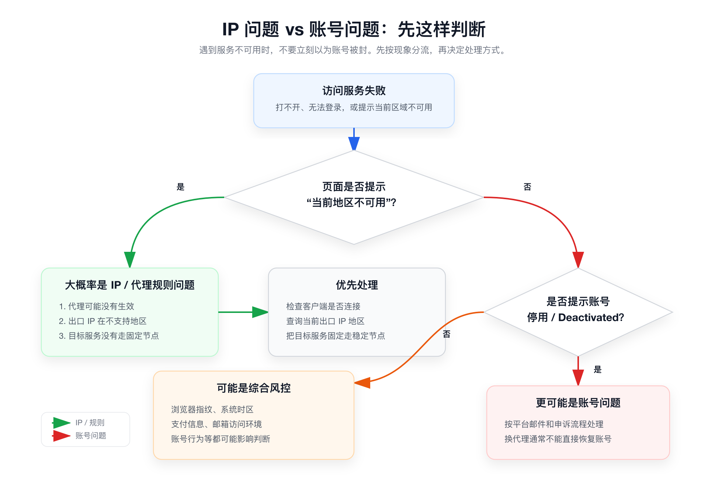

# 使用前必读

这篇教程不是“越快安装越好”的速成手册。对零基础用户来说，第一步不是买服务器，而是先判断：你到底需不需要自建代理服务器。

当你真正掌握完整流程后，后续新增一个代理节点通常 30 分钟以内就能完成。但第一次搭建时，建议慢一点，把每一步为什么要做搞清楚。

如果你已经掌握搭建代理服务器原理和流程，可以针对性选择具体章节阅读。

> ✅ 先看结论：自建代理能解决的是“网络出口更可控”的问题，不是所有账号问题的万能解法。

## 👥 这篇教程适合谁

如果你符合下面几种情况，这篇教程会比较适合你：

- 想拥有一个自己可控的个人代理服务器。
- 希望节点相对稳定，不想频繁更换订阅。
- 希望指定 IP 所在国家或地区。
- 愿意自己承担域名、VPS 和后续维护成本。
- 愿意花一点时间学习最基础的服务器操作。

简单说：你不需要有技术背景，但需要愿意按步骤操作，并接受后续需要自己维护。

## 🚫 这篇教程不适合谁

如果你只是想马上用、完全不想维护，那购买成熟服务可能更省心。

这篇教程不适合下面几类需求：

- 只想“一键可用”，完全不想管服务器。
- 不愿意承担服务商停机、线路波动、平台风控等不确定性。
- 希望用代理解决所有账号封禁问题。
- 准备把节点卖给很多陌生人使用。

> ⚠️ 提醒：自建不等于绝对稳定，也不等于绝对安全。稳定性取决于服务商、线路、配置和你的维护习惯。

## 🔎 先判断：你是 IP 问题，还是账号问题

很多人一看到网站打不开，就以为账号被封。其实常见情况可以分成三类。

## 🌍 情况一：当前地区不可用

如果页面提示“当前地区不可用”，通常是 IP 所在地区不被支持，或者代理规则没有生效。

这种情况一般不是封号，而是网络出口的问题。

你要做的是：

1. 确认代理客户端已经连接。
2. 查询当前出口 IP 在哪个国家或地区。
3. 确认当前 IP 不是大陆、香港或其他不支持地区。
4. 给目标服务配置稳定的规则，让它固定走同一个可用节点。

## 🔐 情况二：账号被停用

如果账号出现 `Access Deactivated` 这类停用提示，通常是账号本身触发了平台规则或安全机制。

这种情况下，换一个代理节点未必能解决问题。

你要做的是：

1. 回忆近期是否有异常使用行为。
2. 查看平台邮件和站内通知。
3. 按平台申诉流程处理。
4. 后续规范使用账号。

## 🧭 情况三：平台综合风控

有些平台不只看 IP。浏览器指纹、系统时区、支付信息、邮箱访问环境、账号行为等，都可能影响平台判断。

比如 Anthropic 这类平台，风控往往不是单纯换 IP 就能解决。

所以，自建代理只能让你的网络出口更可控，不能保证解决所有账号风控问题。

## 📜 合规和服务条款提醒

购买 VPS 前，一定要看服务商条款。有些服务商会明确禁止搭建 VPN、代理或类似服务。

即使技术上可以安装，也可能违反服务商规则，导致服务器被暂停、账号被限制，甚至无法退款。

请务必记住：

- 遵守所在地法律法规。
- 遵守 VPS 服务商的使用条款。
- 遵守目标网站和平台的服务条款。
- 不要把个人节点用于商业转售、群控、滥用或违法用途。

> ✅ 建议：如果不确定某家服务商是否允许相关用途，购买前先查看服务条款，或者咨询客服。
