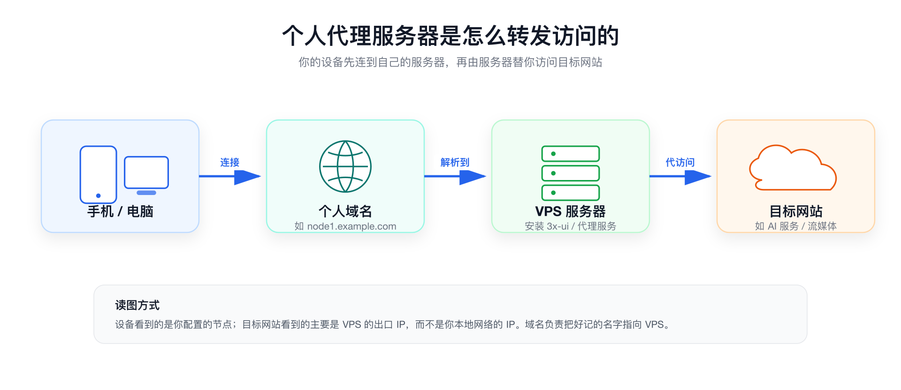

# 代理服务器工作原理

这一章先不讲安装命令，只讲一件事：个人代理服务器到底是怎么工作的。

理解这一章后，后面看到“域名、VPS、3x-ui、客户端、节点”这些词，就不会觉得它们是完全陌生的东西。

## 🧠 一句话解释

你的手机或电脑不直接访问目标网站，而是先连接到你自己的海外服务器，再由这台服务器替你访问目标网站。



也可以简单理解成：

```text
你的设备 -> 代理客户端 -> 个人域名 -> VPS 服务器 -> 目标网站
```

## 🧩 三个核心组件

搭建个人代理服务器，最核心的是这三个东西。

| 组件 | 白话解释 | 它负责什么 |
| --- | --- | --- |
| 域名 | 服务器的名字 | 让你不用记一串 IP，也方便后续配置证书 |
| VPS | 租来的远程服务器 | 真正运行代理服务，决定你的出口 IP |
| 3x-ui | 网页管理面板 | 用来创建节点、查看流量、复制订阅链接 |

如果用生活里的例子理解：

- 域名像“门牌号”。
- VPS 像“真正办事的房间”。
- 3x-ui 像“房间里的控制面板”。
- 客户端像“你手里的钥匙”。

## 🌐 为什么需要域名

严格来说，不买域名也能搭建，但我建议新手准备一个自己的域名。

原因有三个：

1. 方便配置证书，让连接更接近正常 HTTPS 访问。
2. 后续有多台服务器时，可以用不同子域名区分节点。
3. 服务器 IP 变更时，只需要修改域名解析，不必每个客户端都重新配置。

比如你可以这样命名：

```text
sg1.example.com  -> 新加坡节点
us1.example.com  -> 美国节点
backup.example.com -> 备用节点
```

## 🖥️ VPS 决定了什么

VPS 是你租来的海外服务器。目标网站看到的，主要是这台 VPS 的出口 IP，而不是你家里宽带或手机网络的 IP。

所以，VPS 会影响这些体验：

- IP 所在国家或地区。
- 访问速度。
- 稳定性。
- 每月流量和成本。
- 是否容易因为服务商规则被限制。

这也是为什么后面要单独讲 VPS 选型。服务器买错了，后面配置再认真，也可能体验不好。

## 🛠️ 为什么选择 3x-ui

3x-ui 是一个开源的 Xray-core 管理面板。它提供网页界面，可以管理代理节点、查看流量、生成分享链接和订阅链接。

对新手来说，它最大的好处是：不用一开始就手写复杂配置文件。

你可以把 3x-ui 理解成服务器上的“代理服务管理后台”。后面创建节点、复制订阅链接、查看用量，基本都在这个后台里完成。

> ⚠️ 注意：3x-ui 官方也提示项目面向个人用途，不应用于非法用途或生产环境。本教程只讨论个人学习和个人网络环境管理。

## ✅ 读完这一章你需要记住

- 域名负责“把名字指向服务器”。
- VPS 负责“真正替你访问目标网站”。
- 3x-ui 负责“在服务器上管理代理节点”。
- 客户端负责“让你的手机或电脑连接到节点”。
- 自建代理解决的是“网络出口更可控”的问题，不是所有账号风控问题。
