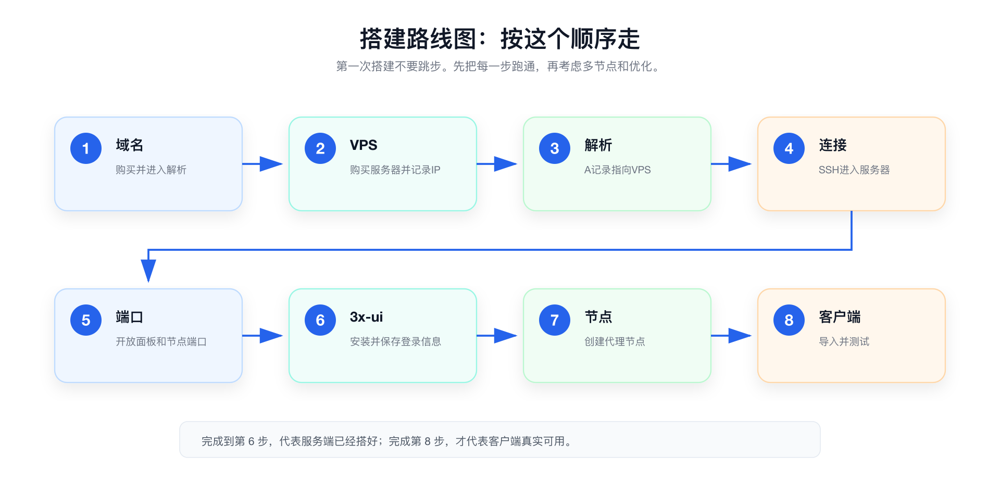

# 准备清单

正式购买域名和 VPS 之前，先把需要的账号、工具和记录表准备好。

这一步看起来简单，但很重要。后面搭建过程中会不断出现域名、IP、端口、账号、密码、面板地址等信息。如果一开始不记录好，后面很容易忘记或填错。

> ✅ 先看结论：这一章不需要你安装任何东西，只需要把“账号、电脑、付款方式、记录表”准备好。

先不用记住每一步的细节，只要知道整体顺序：先准备域名和 VPS，再做解析、连接服务器、开放端口，最后安装 3x-ui 并创建节点。

## 🧾 账号和支付

你至少需要准备这些账号和支付方式：

- 一个常用邮箱。
- 一个域名注册平台账号。
- 一个 VPS 服务商账号。
- 一个可用于付款的支付方式。

这里的域名平台和 VPS 平台可以不是同一家。比如域名在阿里云买，VPS 在其他服务商买，也完全可以。

## 💻 设备和工具

建议用电脑完成第一次搭建，不建议只用手机操作。

你需要准备：

- 一台电脑。
- 一个文本记录工具，用来保存域名、IP、账号、端口等信息。
- 一个代理客户端，后续用于导入节点。

记录工具可以很简单，比如备忘录、Markdown 文档、表格，或者密码管理器。关键是不要只靠记忆。

> ⚠️ 注意：账号、密码、订阅链接不要公开分享，也不要放到公开文档里。

## 🧩 新手推荐配置

如果你是第一次搭建，可以先按下面的配置选择。不要一开始就追求多节点或复杂配置，先把完整流程跑通更重要。

| 项目 | 建议 | 说明 |
| --- | --- | --- |
| 域名 | 便宜后缀即可 | 例如 `.xyz`，注意第二年续费价格 |
| VPS 地区 | 新加坡或美国 | 结合目标服务、速度和稳定性选择 |
| VPS 系统 | Ubuntu LTS | 教程和工具兼容性更好 |
| VPS 数量 | 先买 1 台 | 跑通流程后再考虑多节点 |
| 内存 | 1GB 起步 | 个人轻量使用通常够用 |
| 带宽 | 建议 30M 起步 | 带宽越大体验越好，但价格也会提高 |

这里的配置不是唯一答案，只是给新手一个不容易踩坑的起点。

## 🗂️ 信息记录表

搭建过程中，建议你把下面这些信息记录下来。

| 信息 | 内容 |
| --- | --- |
| 域名 | 待填写 |
| VPS 服务商 | 待填写 |
| VPS 地区 | 待填写 |
| VPS 公网 IP | 待填写 |
| SSH 用户名及密码 | 待填写 |
| SSH 端口 | 待填写 |
| 3x-ui 面板地址 | 待填写 |
| 3x-ui 用户名 | 待填写 |
| 3x-ui 密码 | 待填写 |

如果你不想把密码直接写在文档里，也可以只写“保存在某个密码管理器里”，不要把敏感信息放在容易泄露的位置。

## ✅ 准备完成的标准

开始下一章之前，确认你已经准备好：

- 可以正常登录邮箱。
- 有可用的付款方式。
- 知道准备用哪个平台购买域名。
- 知道准备用哪个平台购买 VPS。
- 有地方记录服务器和面板信息。
- 知道后面会优先购买一台 VPS，而不是一开始买多台。
