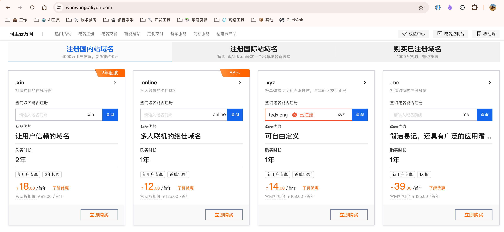
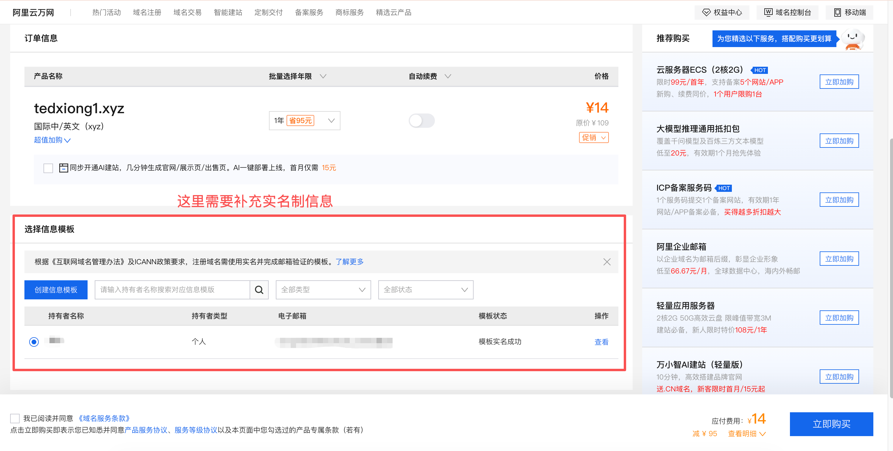
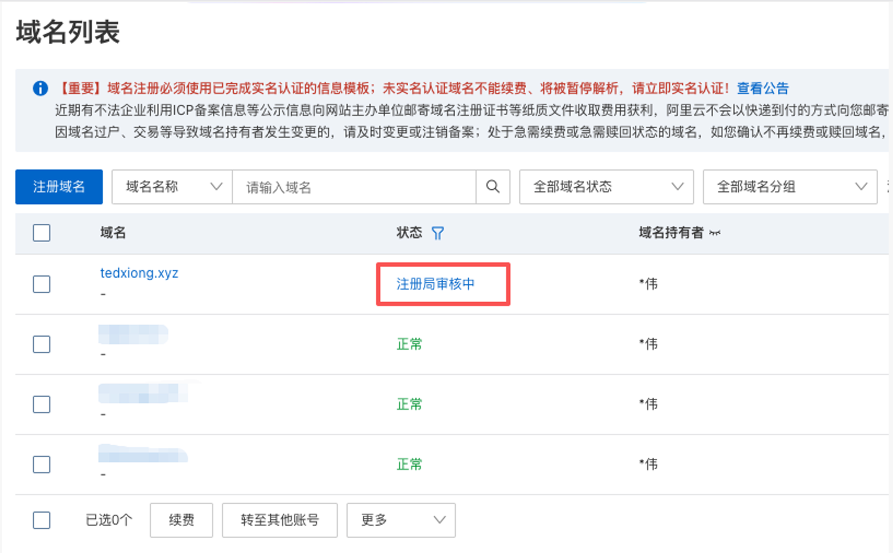
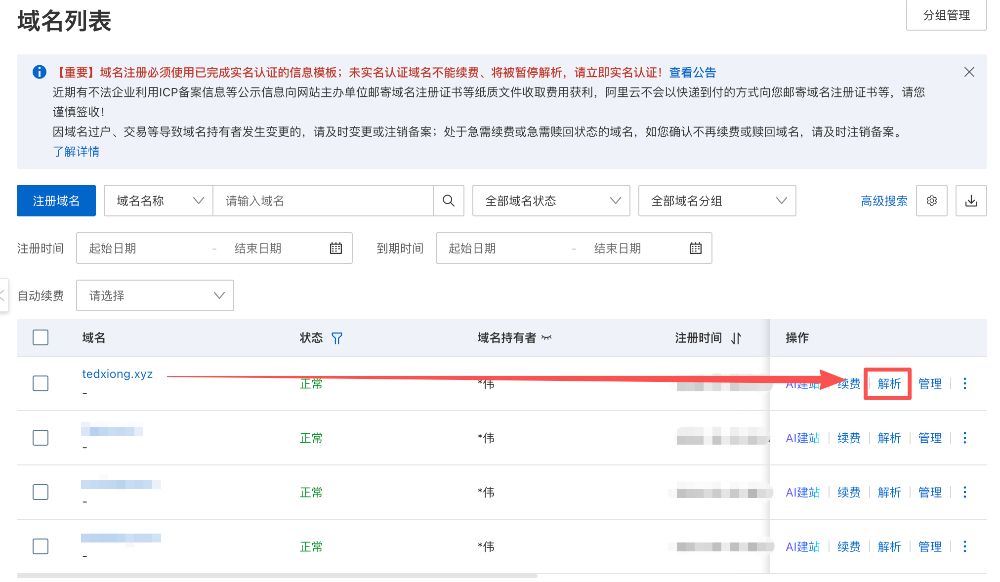

# 购买个人域名

这一章先完成一件事：买一个自己的域名，并找到后面要用到的“解析”入口。

域名不是必须，但我建议新手准备一个。后面配置证书、区分不同服务器、管理多个节点时，都会方便很多。

> ✅ 先看结论：如果你是第一次搭建，优先选一个便宜、好管理的域名即可，不用追求好看或稀缺。

## 🌐 为什么要买域名

域名可以理解成服务器的名字。没有域名也能搭建，但有域名会更适合长期使用。

主要好处有四个：

- 后续可以配置证书。
- 比直接记 IP 更方便。
- 多台服务器时，可以用 `node1.example.com`、`node2.example.com` 区分。
- 服务器 IP 改了，只需要修改域名解析，不用重新修改每个客户端里的 IP 地址。

## 🧭 为什么这里推荐阿里云

阿里云域名注册入口是：[https://wanwang.aliyun.com/](https://wanwang.aliyun.com/)

我这里推荐新手用阿里云，不是因为它一定最便宜，而是因为它对中文用户来说比较简单：

- 中文界面清楚。
- 支付和实名认证流程比较熟悉。
- 域名注册、实名认证、解析入口都在同一个控制台里。
- 后续截图和教程步骤更容易对应。

当然，域名不是只能在阿里云买。也有很多国外域名注册商不需要国内实名认证，而且价格可能更便宜。只是这些平台的付款方式、英文界面、账号风控和 DNS 设置对新手不一定友好。

> 💬 如果你已经有经验，或者想找更便宜、不需要实名认证的域名平台，可以单独研究或咨询。第一次搭建时，建议先选简单路线，把流程跑通。

## 🏷️ 域名怎么选

新手优先考虑便宜、容易购买、容易管理的域名。

常见后缀包括：

- `.xyz`
- `.top`
- `.com`

购买时不要只看首年价格，也要看续费价格。很多域名第一年很便宜，第二年会贵不少。

> ⚠️ 提醒：域名只是用来连接你的服务器，不需要买特别贵、特别短、特别像品牌名的域名。

## 🛒 第一步：搜索并购买域名

打开阿里云万网域名注册页面：

[https://wanwang.aliyun.com/](https://wanwang.aliyun.com/)

在搜索框里输入你想要的域名前缀，看看有没有可以注册的后缀。如果你想要的名字已经被注册，就换一个名字或者换一个后缀。

选好域名后，点击购买，进入订单确认页面。第一次购买域名时，通常需要补充实名制信息。

## 🪪 第二步：补充实名认证信息

根据国内域名管理要求，在阿里云购买域名通常需要选择或创建实名信息模板。

你需要补充的信息一般包括：

- 域名持有者类型。
- 持有者姓名或主体信息。
- 联系邮箱。
- 证件或实名认证信息。

如果你之前已经在阿里云做过实名认证，可以直接选择已有的信息模板。否则就按页面提示创建。

> ⚠️ 提醒：实名信息要认真填写。域名注册信息不完整，可能会影响域名续费、解析或后续管理。

## ⏳ 第三步：等待注册局审核

购买完成后，域名不一定马上变成“正常”状态。首次注册或实名信息变更后，可能会出现“注册局审核中”。

这一步通常不需要你额外操作，只需要等待审核完成。

审核时间不一定固定，可能十几分钟，也可能几个小时。等状态变成“正常”后，再继续下一步。

> ✅ 判断标准：域名列表里显示“正常”，说明这个域名已经可以继续配置解析。

## 🧷 第四步：进入域名解析入口

域名状态正常后，进入域名列表，找到刚刚购买的域名，点击右侧的“解析”。

进入解析页面后，先不用急着添加记录。后面购买 VPS 后，我们会拿到服务器公网 IP，再把域名解析到这台服务器。

## ✅ 这一章你需要得到什么

完成这一章后，你至少要得到：

- 一个已经购买成功的域名。
- 域名状态显示为“正常”。
- 能在阿里云控制台找到“解析”入口。
- 知道后面要把这个域名解析到 VPS 公网 IP。

如果域名还在“注册局审核中”，可以先暂停在这里，等审核通过后再继续。
