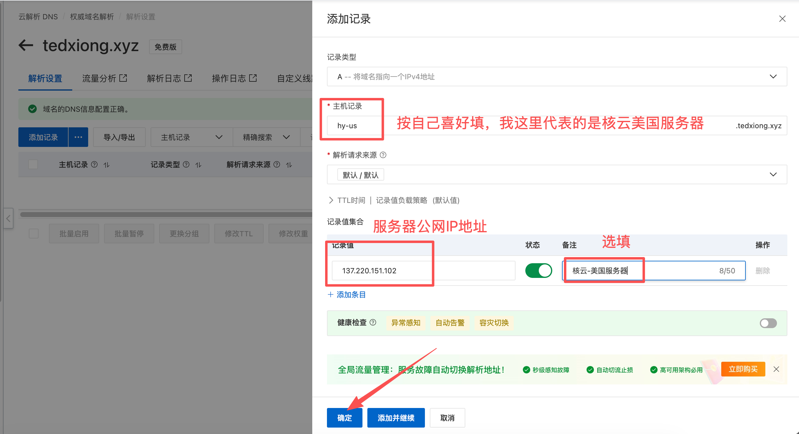
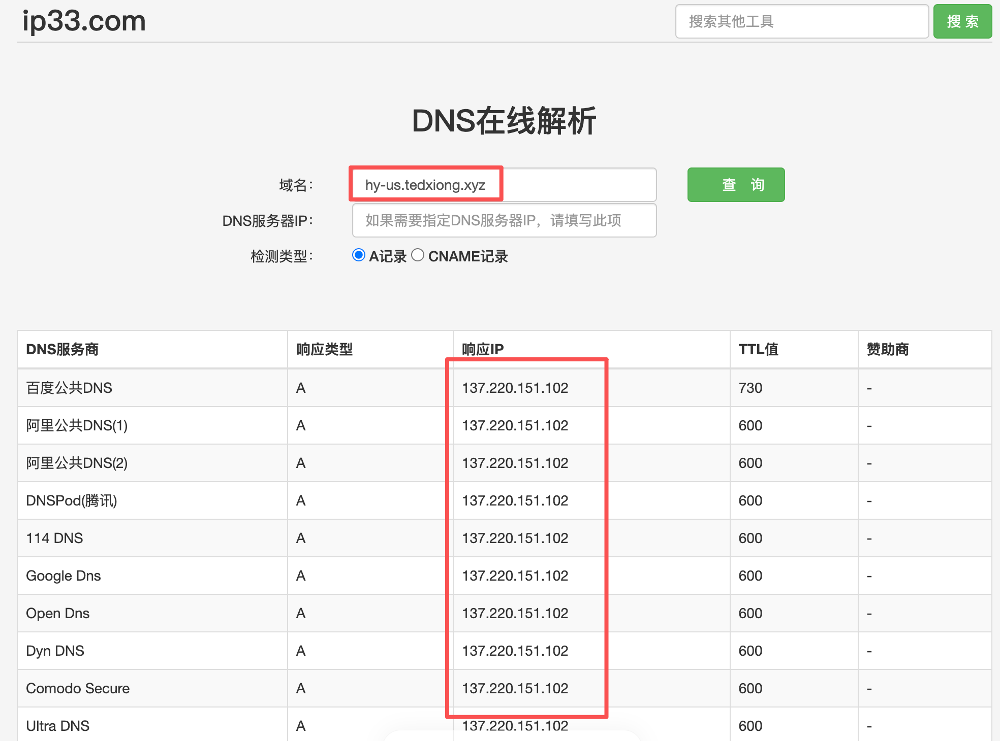

# 配置域名解析

这一章要做的事很简单：把你刚买的域名，指向刚买的 VPS 公网 IP。

域名解析可以理解成“告诉互联网：这个名字应该访问哪台服务器”。配置完成后，你就可以用类似 `hy-us.example.com` 这样的域名找到自己的 VPS。

> ✅ 先看结论：这里要添加的是一条 `A` 记录，记录值填写 VPS 的公网 IP。

## 🧠 域名解析是什么

VPS 有一个公网 IP，比如：

```text
137.220.151.102
```

但是 IP 不好记，也不方便以后更换服务器。所以我们会给它绑定一个域名，比如：

```text
hy-us.example.com
```

以后客户端连接时，就可以优先使用域名。即使后面换服务器，也只需要改解析记录。

## 🏷️ 推荐命名方式

如果你只有一台服务器，可以用简单一点的名字：

```text
node1.example.com
```

如果你想让名字更容易识别，也可以按地区或服务商命名：

```text
sg1.example.com     -> 新加坡节点
us1.example.com     -> 美国节点
hy-us.example.com   -> 核云美国服务器
lisa-us.example.com -> 丽萨美国服务器
```

主机记录可以按自己喜好填写。重点是：你自己以后能看懂它代表哪台服务器。

## 🧷 添加 A 记录

进入阿里云域名解析页面，点击“添加记录”，然后填写一条 A 记录。

| 字段 | 示例 | 说明 |
| --- | --- | --- |
| 记录类型 | `A` | 表示把域名指向一个 IPv4 地址 |
| 主机记录 | `hy-us` | 最终域名会变成 `hy-us.example.com` |
| 解析请求来源 | 默认 | 新手保持默认即可 |
| 记录值 | VPS 公网 IP | 从 VPS 控制台复制 |
| TTL | 默认 | 新手不用改 |
| 备注 | 核云-美国服务器 | 可选，方便自己识别 |



填写完成后，点击“确定”。如果保存成功，解析列表里会出现这条记录。

> ⚠️ 注意：记录值一定要填 VPS 的公网 IP，不要填内网 IP，也不要填服务器用户名、密码或其他信息。

## ⏳ 等待解析生效

DNS 解析通常不是立即全球生效。多数情况下几分钟内就能查到，但有时也可能需要更久。

如果刚添加完马上查不到，不一定是填错了。可以等几分钟再查询。

## 🔎 查询 DNS 是否生效

可以使用这个在线工具查询：

[https://www.ip33.com/dns.html](https://www.ip33.com/dns.html)

打开页面后：

1. 在“域名”里输入完整域名，例如 `hy-us.example.com`。
2. 检测类型选择 `A记录`。
3. 点击“查询”。
4. 查看返回的“响应 IP”是否等于你的 VPS 公网 IP。



如果多个 DNS 服务商返回的 IP 都是你的 VPS 公网 IP，说明解析已经基本生效。

## 🧪 也可以用命令简单检查

如果你会打开电脑终端，也可以输入：

```bash
ping hy-us.example.com
```

如果显示的 IP 是你的 VPS 公网 IP，说明解析大概率已经生效。

不过要注意：有些服务商或机房会禁 ping。禁 ping 不代表解析失败，更准确的方式还是看 DNS 查询结果里的响应 IP。

## ✅ 这一章你需要得到什么

完成这一章后，你至少要得到：

- 一个指向 VPS 公网 IP 的子域名。
- 阿里云解析列表里能看到对应 A 记录。
- 在 ip33 查询时，响应 IP 等于你的 VPS 公网 IP。

如果查询结果还不是你的 VPS IP，先检查主机记录和记录值有没有填错，再等待几分钟重新查询。
