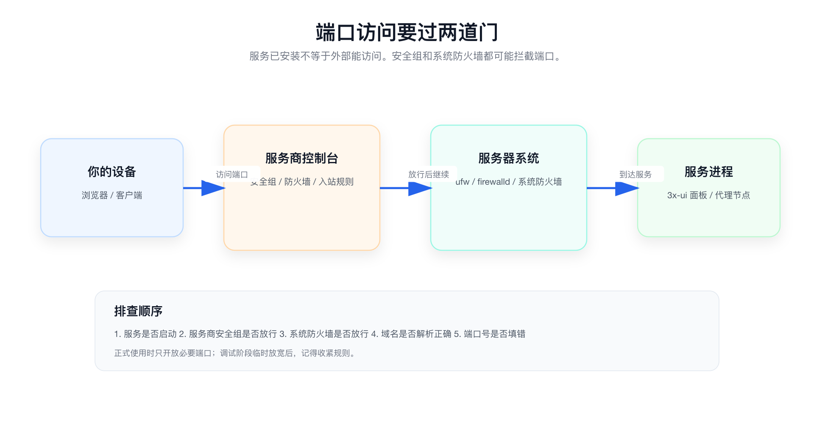
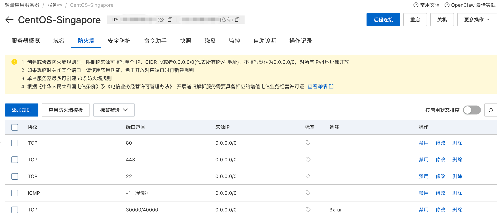
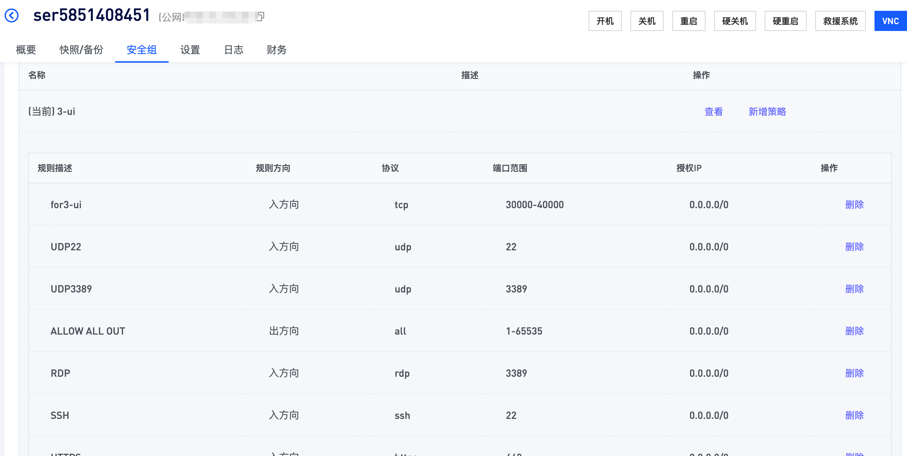

# 开放服务器端口

连接 VPS 之后，安装 3x-ui 之前，还需要确认服务器端口是开放的。

端口可以理解成服务器上的“入口”。后面的 3x-ui 面板、代理节点、证书申请，都可能需要用到不同端口。如果入口没打开，即使服务已经安装成功，外面也访问不到。

> ✅ 先看结论：这一步优先在服务商控制台开放端口。不同服务商叫法不同，可能叫“防火墙”“安全组”“入站规则”。

## 🧠 为什么要开放端口

服务器默认不一定允许外部访问所有端口。

你可以这样理解：

- VPS 是一栋房子。
- 端口是房子的门。
- 防火墙或安全组决定哪些门可以从外面进入。

如果后面 3x-ui 使用了某个端口，但这个端口没有开放，你在浏览器里就打不开面板，客户端也连不上节点。



所以排查端口问题时，不要只看 3x-ui 是否安装成功。外部访问要先经过服务商控制台里的安全组或防火墙，然后才会到服务器系统内部。

## 🔐 需要关注哪些端口

新手不要一上来就纠结所有端口，先记住下面几个常见端口即可。

| 用途 | 常见端口 | 说明 |
| --- | --- | --- |
| SSH 登录 | `22` 或服务商自定义端口 | 用来远程连接 VPS |
| HTTP | `80` | 部分证书申请或网站访问会用到 |
| HTTPS | `443` | 常见安全访问端口 |
| 3x-ui 面板 | 安装时设置的面板端口 | 用来打开管理后台 |
| 代理节点 | 创建节点时设置的端口 | 客户端连接时使用 |

本教程后面为了方便管理，会预留一个自定义端口范围，例如：

```text
30000-40000
```

后面 3x-ui 面板端口和代理节点端口，可以尽量放在这个范围内，方便统一管理。

> ⚠️ 提醒：正式长期使用时，不建议开放所有端口。新手调试阶段可以临时放宽，但跑通后建议只保留真正需要的端口。

## 🧱 服务商控制台和系统防火墙的区别

端口开放可能有两层：

1. 服务商控制台里的防火墙或安全组。
2. 服务器系统内部的防火墙。

很多轻量 VPS 只需要在服务商控制台开放端口即可。

对新手来说，先按服务商控制台操作即可。

## ☁️ 阿里云轻量应用服务器

阿里云轻量应用服务器的端口配置入口大致是：

```text
轻量应用服务器 -> 服务器 -> 选择你的服务器 -> 更多操作 -> 查看详情 -> 防火墙 -> 添加规则
```

进入防火墙页面后，先检查这些端口是否已经开放：

- `22`
- `80`
- `443`

如果没有，就手动添加规则。协议一般选择 `TCP`。

另外建议再添加一个自定义端口范围，例如：

```text
30000/40000
```

这个范围后面可以给 3x-ui 面板和代理节点使用。



> ⚠️ 不建议直接长期开放 `1/65535`。如果只是为了临时排查问题，可以短时间放宽；正式使用时，建议只开放需要的端口。

## 🧩 核云

核云的端口配置一般在“安全组”里。

大致流程是：

1. 进入服务器详情页。
2. 找到“安全组”。
3. 新增安全组，或者进入当前安全组。
4. 点击“新增策略”。
5. 规则方向选择“入方向”。
6. 协议选择自定义 `TCP`。
7. 端口范围填写 `30000-40000`。
8. 授权 IP 填写 `0.0.0.0/0`。
9. 保存规则。

最终效果类似下面这样：



这里的 `0.0.0.0/0` 表示允许所有 IPv4 地址访问这个端口范围。新手配置比较省事，但安全性会弱一些。后续熟悉后，可以根据自己的实际 IP 再缩小范围。

## 🏠 丽萨

丽萨的配置流程和核云类似，通常也是在服务器控制台里找到“安全组”“防火墙”或类似入口，然后添加入方向规则。

可以按同样思路处理：

- 协议选择 `TCP`。
- 端口范围填写 `30000-40000`。
- 授权 IP 填写 `0.0.0.0/0`。
- 保存后确认规则已经生效。

如果页面名称和核云不完全一样，重点找这几个关键词：

- 安全组。
- 防火墙。
- 入方向。
- 端口范围。
- 授权 IP。

## 🧪 如何判断端口是否开放

端口是否开放，不能只看自己有没有添加规则。更准确的判断是：外部能不能访问到这个端口。

后面安装 3x-ui 后，可以通过浏览器访问面板地址来验证。

如果访问不了，排查顺序建议是：

1. 服务是否已经启动。
2. 服务商控制台安全组是否放行。
3. 服务器系统防火墙是否放行。
4. 域名解析是否指向正确 VPS。
5. 端口号是否填错。

## ✅ 这一章你需要得到什么

完成这一章后，你至少要知道：

- 端口开放决定哪些端口的流量能从外部进来。
- 阿里云通常在“防火墙”里添加规则。
- 核云和丽萨通常在“安全组”里添加规则。
- 不要长期开放所有端口。
- 后面安装 3x-ui 时，要记录面板端口和节点端口。
